<!--

  

 
 

  

---

I write code on stage in front of a crowd. You'll find me at meetups, conferences, hackathons, or online communities.

---

### 👥 Social

- 🐦 [Twitter @anthonyjdella](https://twitter.com/anthonyjdella)
- 💼 [LinkedIn @anthonydellavecchia](https://www.linkedin.com/in/anthonydellavecchia/)
- :octocat: [GitHub @anthonyjdella](https://github.com/anthonyjdella)
- 📹 [Twitch @anthonyjdella](https://www.twitch.tv/anthonyjdella)
- 🕺 [TikTok @anthonyjdella](https://tiktok.com/@anthonyjdella)
- ❇️ [Polywork @anthonyjdella](https://www.polywork.com/anthonyjdella)
- 📓 [Dev.to @anthonyjdella](https://dev.to/anthonyjdella)
- 📝 [Hashnode @anthonyjdella](https://anthonyjdella.hashnode.dev/)
- 📂 [Medium @anthonyjdella](https://medium.com/@anthonyjdella)
- 📧 [Email dev@anthonydellavecchia.com](mailto:dev@anthonydellavecchia.com)
- 🌐 [Website @www.anthonydellavecchia.com](https://anthonydellavecchia.com)
- 📦 [npm @anthonyjdella](https://npmjs.com/~anthonyjdella)
- 🗣 [Notist @anthonyjdella](https://noti.st/anthonyjdella)

---

### 💻 Personal Projects

- [Web5 Issue Credentials](https://github.com/anthonyjdella/tbd-issue-credential) | Decentralized identity, so you control your identity on the Internet, not corporations
- [Daily Sit-Down](https://github.com/anthonyjdella/level-up-with-twilio-studio) | Save your status to Airtable with this quick asynchronous app
- [Summarize Text from Images](https://github.com/anthonyjdella/summarize-text) | Take a picture of book, get a text with a summary of what it says
- [TwilioQuest Extension](https://github.com/anthonyjdella/twilio-quest-booth-mission) | A video game extenstion for TwilioQuest with player challenges to teach Twilio APIs
- [NBA News](https://github.com/anthonyjdella/nba-news) | A simple app that texts you NBA news
- [Personal Site](https://github.com/anthonyjdella/personal-website) | My website that showcases some work I've done
- [New Job Alerts](https://github.com/anthonyjdella/automated-job-web-scraping) | A web scraper that searches for jobs and sends you an email with those listings
- [JSON Resume](https://github.com/anthonyjdella/customized-resume-schema) | A customized JSON Resume Schema for my personal resume
- [Resume Themes](https://github.com/anthonyjdella/customized-jsonresume-theme-mocha-responsive) | This is one of many resume themes that I've tweaked
- [DevRel Roadmap](https://github.com/anthonyjdella/roadmap) | A drag 'n drop Kanban board with things I want to accomplish as an IC in DevRel

---

### 🗣 Public Speaking

| Event | Location | Date | Topic | Reference      |
|------|:-------:|:-----:|:------:|--------|
| [HackPNW](https://www.hackpnw.org/) | Seattle,&nbsp;🌧️ | February 4, 2023 | Workshop, [Build with Studio](https://github.com/anthonyjdella/hack-pnw-2023) | [🖥&nbsp;Repo](https://github.com/anthonyjdella/hack-pnw-2023) |
| [Level Up with Studio](https://interactive.twilio.com/level-up-with-studio-prototype-enhance-and-share-your-workflows-webinar) | Online,&nbsp;🌐 | January 26, 2023 | Webinar, [Prototype, Enhance, and Share your Workflows](https://interactive.twilio.com/level-up-with-studio-prototype-enhance-and-share-your-workflows-webinar) | [📹&nbsp;Video](https://interactive.twilio.com/level-up-with-studio-prototype-enhance-and-share-your-workflows-webinar) |
| [Stack Overflow Podcast](https://stackoverflow.blog/podcast/) | Online,&nbsp;🌐 | December 20, 2022 | Talk, [Let’s talk about our favorite terminal tools](https://stackoverflow.blog/2022/12/20/lets-talk-about-our-favorite-terminal-tools/) | [🖥&nbsp;Transcript](https://the-stack-overflow-podcast.simplecast.com/episodes/talking-about-our-favorite-terminal-tools/transcript/) |
| [Halloween Party](https://www.meetup.com/twilio-seattle/events/288926681/) | Seattle,&nbsp;🌧️ | October 24, 2022 | Talk, [Do you like scary movies?](https://www.twilio.com/blog/do-you-like-scary-movies-build-a-halloween-project-with-twilio) | [🖥&nbsp;Slides](https://noti.st/anthonyjdella/YEMatV/do-you-like-scary-movies) |
| [Spiceworld 2022](https://www.spiceworks.com/spiceworld/) | Austin,&nbsp;🥩 | September 28, 2022 | Workshop, [Summarize Text from Images using AI and Twilio](https://www.twilio.com/blog/summarize-text-from-images-using-ai-and-twilio) | [🖥&nbsp;Slides](https://noti.st/anthonyjdella/L6gFMA/summarize-text-from-images-using-ai-and-twilio) |
| [PennApps](https://2022f.pennapps.com/) | Philadelphia,&nbsp;🔔 | September 3, 2022 | Workshop, [Summarize Text from Images using AI and Twilio](https://www.twilio.com/blog/summarize-text-from-images-using-ai-and-twilio) | [🖥&nbsp;Slides](https://noti.st/anthonyjdella/imxRTl/summarize-text-from-images-using-ai-and-twilio) |
| [Seattle Meetup](https://www.meetup.com/twilio-seattle/events/287291753/) | Seattle,&nbsp;🌧️ | August 18, 2022 | Workshop, Learning to Code? Let’s Send Text Messages by Writing Code | [🖥&nbsp;Slides](https://noti.st/anthonyjdella/U9Vpix/learning-to-code-lets-send-texts-by-writing-code) |
| [API Days NYC](https://www.apidays.global/new-york/) | NYC,&nbsp;🗽 | July 28, 2022 | Workshop, [Let's Live Code an App that Texts NBA News](https://www.twilio.com/blog/get-the-latest-nba-news-sent-to-your-phone-via-sms) | [📹&nbsp;Video](https://www.youtube.com/watch?v=LnfYf6baTQs) |
| [API Days NYC](https://www.apidays.global/new-york/) | NYC,&nbsp;🗽 | July 28, 2022 | Talk, [Gaining Trust in APIs and What to Look For](https://anthonydellavecchia.com/blog/gaining_trust_in_apis/) | [📹&nbsp;Video](https://www.youtube.com/watch?v=elgcCqnNeEs) |
| [Transform Together Superclass 2022](https://www.twilioengageeverywhere.com/chicago/home) | Chicago,&nbsp;🍕 | June 16, 2022 | Workshop, [Mars Rover Emails with Twilio Sendgrid](https://www.twilio.com/blog/mars-rover-emails-with-python-and-twilio-sendgrid) | [🖥&nbsp;Slides](https://noti.st/anthonyjdella/6TEdbM/mars-rover-emails-with-twilio-sendgrid) |
| [State Farm](https://www.statefarm.com/) | Dallas,&nbsp;🤠 | December 12, 2021 | Talk, [What is Chaos Engineering?](https://soundcloud.com/anthony-dellavecchia/what-is-chaos-engineering?si=ffec7e78bfa5410c9611513b331e8095&utm_source=clipboard&utm_medium=text&utm_campaign=social_sharing) | [🎤&nbsp;Audio](https://soundcloud.com/anthony-dellavecchia/what-is-chaos-engineering?si=ffec7e78bfa5410c9611513b331e8095&utm_source=clipboard&utm_medium=text&utm_campaign=social_sharing) |

---

### ✏️ Technical Writing

- 🔒 [Use Your Fingerprint with 1Password to Authenticate the Twilio CLI](https://www.twilio.com/blog/use-your-fingerprint-with-1password-to-authenticate-twilio-cli) | December 7, 2022
- 🤖 [AI Wrote this Blog Post About Taking Over Your Job](https://anthonydellavecchia.com/blog/this-blog-post-is-written-by-ai/) | December 2, 2022
- 🤝 [Gaining Trust in APIs](https://www.apiscene.io/api-security-identity/gaining-trust-in-apis-and-what-to-look-for/) | November 2, 2022
- 👻 [Do you like scary movies?](https://www.twilio.com/blog/do-you-like-scary-movies-build-a-halloween-project-with-twilio) | October 31, 2022
- 📝 [Summarize Text from Images using AI and Twilio](https://www.twilio.com/blog/summarize-text-from-images-using-ai-and-twilio) | September 1, 2022
- 🏀 [Get the Latest NBA News Sent to your Phone via SMS](https://www.twilio.com/blog/get-the-latest-nba-news-sent-to-your-phone-via-sms) | July 21, 2022
- 👋 [Introducing Developer Evangelist Anthony Dellavecchia](https://www.twilio.com/blog/introducing-twilio-developer-evangelist-anthony-dellavecchia) | June 2, 2022
- 🤖 [What are APIs Part 2](https://anthonydellavecchia.com/blog/what-are-apis-2/) | March 10, 2022
- 🤖 [What are APIs Part 1](https://anthonydellavecchia.com/blog/what-are-apis-1/) | February 9, 2022
- 🖊️ [Fonts for Programmers](https://anthonydellavecchia.com/blog/fonts-for-programmers/) | January 27, 2022
- 🎨 [Updating my Avatar](https://anthonydellavecchia.com/blog/updating-my-avatar/) | January 19, 2022
- 💽 [MongoDB Atlas Hackathon](https://anthonydellavecchia.com/blog/mongodb-atlas-hackathon/) | January 17, 2022
- 😈 [Rogue Dev Purposely Breaks Software](https://anthonydellavecchia.com/blog/rogue-dev-purposely-breaks-software/) | January 9, 2022
- 🔍 [How to Add Search to your Hugo Static Site](https://anthonydellavecchia.com/blog/how-to-add-search-to-your-hugo-static-site/) | January 8, 2022
- 9️⃣ [Is 99 Good?](https://anthonydellavecchia.com/blog/is-99-good/) | January 4, 2022
- 📩 [How to Forward Emails to your Domain](https://anthonydellavecchia.com/blog/how-to-forward-emails-to-your-domain/) | December 30, 2021
- 🌐 [Launch Insights](https://anthonydellavecchia.com/blog/launch-insights/) | December 28, 2021
- 👀 [How to Check your Website Users](https://anthonydellavecchia.com/blog/how-to-check-your-website-users/) | December 4, 2021
- 👋 [How to Animate an Emoji with CSS](https://anthonydellavecchia.com/blog/how-to-animate-an-emoji-with-css/) | December 1, 2021
- 👨‍🎨 [Designing an Animated Logo](https://anthonydellavecchia.com/blog/designing-an-animated-logo/) | October 25, 2021
- 🧙 [Magic Numbers](https://anthonydellavecchia.com/blog/magic-numbers/) | April 17, 2021
- 💼 [How to Never Miss Out on a Job Opening](https://anthonydellavecchia.com/blog/how-to-never-miss-out-on-a-job-opening/) | March 21, 2018
  

  <!--<table>
  <tr>
    <th>Contributions</th>
    <th>Stats</th>
  </tr>
  <tr>
    <td></td>
    <td></td>
  </tr>
</table>
-->

  

  
  

  <!--
  

-->

